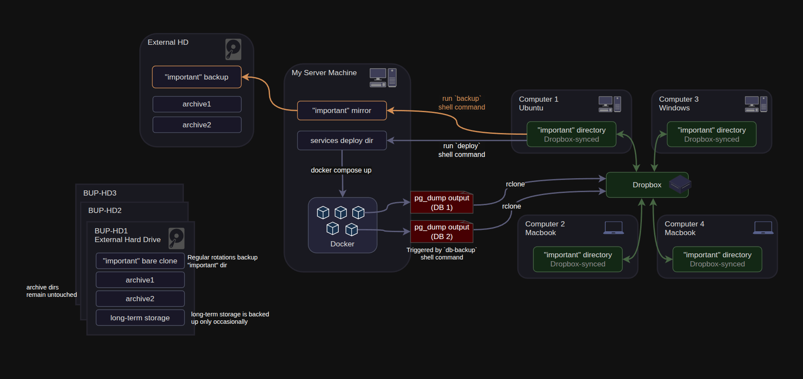
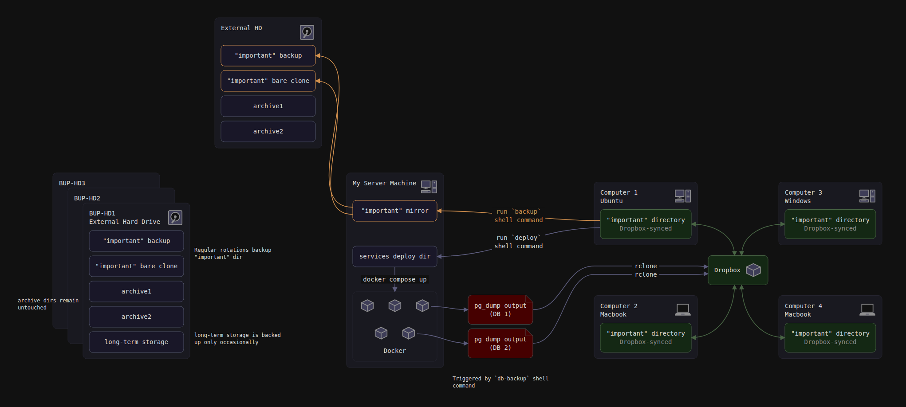

# reladraw

A text language for diagrams where **placement is stated, not computed**.

A diagram drawn by hand in draw.io:



And the same diagram written down in reladraw and rendered from the text — [`examples/arch.reladraw`](examples/arch.reladraw), 56 statements, no coordinates anywhere in it:



Every distance in the second picture was worked out from statements like `above-left of dropbox` and `between computer1 and computer2`. Nothing chose the arrangement; the file states it.

## The gap

Mermaid, Graphviz and D2 all take the same shape: you declare entities and connections, and a layout algorithm decides where things go. Placement is an output. That makes the result unpredictable from the source, which is tolerable for a person who can look at the render and fiddle, and close to useless for an agent that cannot see what it produced.

Absolute tools like draw.io have the opposite problem: total control, expressed as pixel coordinates that carry no meaning, which no agent can meaningfully edit and no human enjoys typing.

Nothing occupies the middle. This is an attempt at it — a language where you say where things go in the terms a person would use out loud, and never name a coordinate:

```
box dropbox          "Dropbox"
box computer1        "Computer 1 / Ubuntu"  above-left of dropbox
box computer1.files  "\"important\" directory"  style: synced

link computer1.files <-> dropbox  style: synced
```

One statement per line. Containment is a dotted name. Nothing is nested, so no line depends on another line's position or indentation.

The draft is in [SYNTAX.md](SYNTAX.md), with a worked example in [examples/](examples/).

## Why an agent needs this

An agent cannot see what it produced. Emitting Mermaid means guessing at an output it has no way to check, because the layout is an emergent property of an algorithm that runs later. That is why agents fall back to prose and ASCII boxes — ASCII is bad at everything except the one thing that matters here, which is that the source *is* the output.

Reading matters more than writing, and it is where every other tool is weakest. Ask an agent to move the auth service left and add a queue behind it. Given pixel coordinates it has to reconstruct a picture from numbers before it can reason at all; given auto-layout there is no stored intent to read, because the arrangement was never written down. Given stated placement it reads sentences and already knows the arrangement. Diagrams get changed far more often than they get created, so this is the common case.

Be precise about what stated placement buys, because it is not everything. Intent comes free: the agent can confirm the database landed under the API and all four machines hang off Dropbox by re-reading its own source. Metric outcomes do not: whether two separately-anchored clusters collide, whether a label overflows its box, whether an edge crosses four others. Placement is stated but still resolved into real coordinates, and a collision between independently-anchored clusters is emergent however clearly each one was written.

So the language does not remove an agent's need to check its output. It changes what checking has to be, which is what the diagnostics in the scope section are for.

## Status

Version 0.1.0. Early, but it runs: a parser, resolver and SVG renderer in TypeScript with no runtime dependencies, and a command-line tool that takes a text file and writes a standalone SVG. The comparison at the top of this page is that pipeline run on [`examples/arch.reladraw`](examples/arch.reladraw). What is still visibly off there is typography, not placement.

```
npm install && npm run build
node dist/cli.js examples/arch.reladraw -o out.svg
```

Not built yet, roughly in the order they are missed:

- **The diagnostics report.** The scope section below says what it is for. Today the tool either renders or fails; it will not tell you what is wrong with a picture it drew successfully.
- **Edge routing around boxes.** A link can be told which side of a box to leave and arrive on, and which gap to run down on the way. A link that says none of that is a straight line between two centres, and it will cut through whatever stands in the way.
- **More glyphs.** Icons and shapes are closed sets drawn from path data inside the tool, so a diagram wanting one that is not there has nowhere to go.

The language is not stable. Expect the syntax to change.

## How it works

A gap is a *minimum* distance, never an exact one. Say two things sit side by side, then say a third goes between them, and the first two are pushed apart by exactly what the third needs; delete the third and they close back up. No gap anywhere has to be chosen large enough to leave room for something else, and no number goes stale when a label grows. That is the step an author otherwise does by hand — shove things apart to make space, then drag everything back together so the diagram is not full of holes.

So the resolver solves a system rather than walking a chain. Each axis is a set of minimum distances, and the tightest arrangement satisfying all of them is found by longest paths: one answer, no search, no arrangement ever tried and rejected. The engine works out distances; which side of what a thing sits on came from the file.

Solving a system rather than a chain is also what makes non-overlap affordable, and it now holds for every pair of boxes without anyone writing it down. On its own "these two must not overlap" is a choice among four directions, which is the search this whole design refuses — but the file has usually already settled which. If the arrangement you wrote lets one box travel away from another along an axis and offers no way back, that is the only separation your file permits, so nothing is chosen. Where the file orders a pair on neither axis, the tool names the pair rather than guessing. Where it orders them on both, either would do, and the tie breaks toward the axis of least overlap, which is the smallest movement and the one place the tool decides something nobody wrote.

Nothing is nudged. Each round derives the separations the file already implied, adds them as ordinary minimum distances, and solves the whole thing again from scratch. Repairing a solved layout in place is the thing being avoided, and the difference is the entire argument.

## Scope for a first version

- Parser *(done)*
- Deterministic resolver: minimum distances in, tightest arrangement out *(done)*
- Static SVG renderer *(done)*
- A command-line tool: text file in, SVG out *(done)*
- A placement grammar that can say what a real diagram needs: several placements on one box, one thing between two others, exact edge-to-edge alignment *(done)*
- Boxes that do not overlap by default, with the separation direction derived from the stated arrangement *(done)*
- Minimal box-avoiding edge routing
- Machine-readable diagnostics from the solved geometry

Diagnostics are a real output rather than a debugging aid. What they cannot do is stand in for the grammar: a check catches only what the language genuinely leaves open, and "these must not overlap" rules arrangements out without naming one, so it can never place anything. Everything the source cannot tell you is computable once the geometry is solved, with no image involved: overlapping boxes, crossed edges, text exceeding its container, anything off-canvas, large dead regions. So the tool reports `dropbox overlaps machine3` and `edge auth->db crosses 4 edges`, and the fix is written in the same vocabulary as the source. An agent working this way reads a report about a text file it wrote and edits that text file — no rendering, no vision model, no pixel arithmetic.

A diagnostic never repairs a solved layout in place. That is the line the design holds: a checker allowed to nudge boxes is a layout algorithm with a bad search strategy, fixing one overlap into the next with no view of the whole. Deriving a constraint the file already implied and solving the whole system again is a different thing, and is how non-overlap works. What is left over — anything the source genuinely does not settle — is reported, naming the statement that was broken, and the author edits the source. Open, and it decides how far this goes: may a diagnostic describe a fix in words, or only name the symptom? Describing one means the tool has an opinion about layout, which is the auto-layout instinct coming back in through the side door.

Three design problems decide how much machinery this needs, and the first outranks the other two:

**Saying enough.** The benchmark contains arrangements the grammar cannot express at all, which is why some boxes land in the wrong place no matter how the file is written. So the work is adding statements, not restricting them. Expressiveness is not the danger; the engine *choosing* an arrangement is.

**What the engine is allowed to decide.** Auto-layout is refused, because a picture chosen by an algorithm is not predictable from its source, and that predictability is the entire point. Working out coordinates from an arrangement the author stated is a different thing and is simply the job. The test between them: the engine's freedom may affect distances and never relationships. If a default can change which side of something a box sits on, the language was short a statement and the tool should say so rather than guess.

**Overlap and edge routing.** Relative placement with default spacing collides as soon as two clusters grow toward each other. Stating placement and then routing edges afterward with no influence on them reproduces the exact failure this is meant to avoid, so minimal box-avoiding orthogonal routing belongs in the first version. Routing and diagnostics are complements, not substitutes: routing fixes what it can, and the diagnostics report what it could not.

## Prior art

Four things sit near this and none closes the gap.

**[Archify](https://github.com/tt-a1i/archify).** The closest live competitor, and the only one built for agents. An agent writes a typed JSON intermediate representation, a validator checks it against a schema and lints the layout, and it compiles deterministically to a self-contained HTML file. It ships stepped playback and pins nodes to git-verified source lines, and the output looks good. Two things it does not have. Its positioning is grid or free coordinates — auto-arrangement on one side, absolute pixels on the other, with nothing between, which is the same bifurcation in a single tool. And filling in a JSON template tells the agent nothing about the resulting picture, so its loop is still emit, render, look, tweak. That is the Mermaid problem with a linter attached.

**PIC and [pikchr](https://pikchr.org).** The nearest thing in language design: a text diagram format with no layout engine, where placement is stated and deterministic. But it is turtle graphics — a movable cursor that drops shapes and steps along — so a diagram is a sequence of pen movements rather than a set of stated relationships between named things. There is no group that reflows when a member is added.

**Graphviz `rank` and `cluster`.** Constraints on an auto-layout engine rather than a replacement for one, so output stays emergent and unpredictable from the source.

**Structurizr.** Has real manual layout, but is bound to the C4 model, which makes it a modelling notation with a renderer attached rather than a general placement language.

## License

Apache-2.0. This is a reusable primitive where adoption is the value, so restricting commercial use would defeat the purpose. See [LICENSE](LICENSE).

The licence covers the code, not the name: it grants no rights to use "reladraw", the project logo, or the project's other marks. Forks are welcome and should carry a different name. See [NOTICE](NOTICE).

## Contributing

Issues are wanted — especially a diagram you tried to write and could not. Pull requests are read but not merged yet, for a reason explained in [CONTRIBUTING.md](CONTRIBUTING.md).
